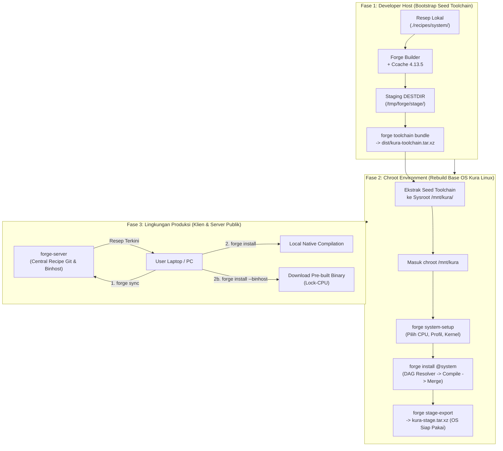

# ARCHITECTURE.md — Blueprint Arsitektur Package Manager `forge` & `forge-server`

> **`forge`** adalah *High-Performance Source-First Hybrid Package Manager* yang dibangun murni menggunakan bahasa **Rust** khusus untuk distribusi **Kura Linux**. Mengadopsi fondasi performa tinggi dari compiler **LLVM**, ultra-fast linker **`mold`**, Link-Time Optimization (**LTO Thin/Full**), dan dukungan **PGO (Profile-Guided Optimization)**, Forge menggabungkan filosofi kompilasi **Gentoo Portage** (*Source-First*, *USE Flags*, *Slots*, *Package Sets*), akselerasi **Ccache (v4.13.5)**, DAG Dependency Resolver, Transactional Merger, Manifest Database, ekosistem **`forge-server` (Lock-CPU Build Farm)**, wizard bootstrap (`forge setup` & `forge system-setup`), serta akselerasi Binhost / CachyOS.

---

## 1. Topologi Cargo Workspace & Struktur Crate Rust (Clean 2-Crate Layout)

Forge dirancang menggunakan arsitektur modular yang terkonsolidasi secara rapi dalam 2 crate utama di dalam Cargo Workspace:

```
                                      [ PENGGUNA KURA LINUX ]
                                                 │
                                                 ▼
+=================================================================================================+
|                                  CRATE 1: `crates/forge`                                        |
|                          (Binary CLI Klien & Core Engine Library)                               |
+=================================================================================================+
|  1. CLI Dispatcher (`src/main.rs`)                                                              |
|     - `forge setup`, `forge system-setup`, `forge install`, `forge remove`, `forge cpu-dump`    |
|     - `forge toolchain bundle`, `forge stage-export`, `forge list`, `forge query`              |
|                                                                                                 |
|  2. Core Engine Library (`src/lib.rs` & sub-modul internal):                                    |
|     ├── `src/builder.rs`   : Compilation Engine, tmpfs sandbox, Ccache 4.13.5, DESTDIR staging   |
|     ├── `src/resolver.rs`  : DAG Dependency Graph, Topological Sort, Circular Cycle Detector   |
|     ├── `src/merger.rs`    : Pre-flight Collision Check, Atomic Transactional Rootfs Merger    |
|     ├── `src/db.rs`        : Flat-File Manifest Database, Unmerge Cleaner, CONFIG_PROTECT       |
|     ├── `src/cpu.rs`       : Hardware Introspection (AVX-512/AVX2/Cache), `forge cpu-dump`      |
|     ├── `src/toolchain.rs` : Pure Source Seed Toolchain Bundler (ADR-019, Zero Host Harvesting) |
|     ├── `src/binhost.rs`   : Forge Binhost Client & Zstd/BLAKE3 streaming verification          |
|     └── `src/hybrid.rs`    : CachyOS (v4/v3) & Arch Linux Fallback Provider                     |
+=================================================================================================+
                                                 ▲
                                                 │ Sinkronisasi Resep & Unduhan Biner
                                                 ▼
+=================================================================================================+
|                                CRATE 2: `crates/forge-server`                                   |
|                            (Daemon Server & CI/CD Build Farm Suite)                             |
+=================================================================================================+
|  1. `forge-server serve`  : Recipe Registry HTTP API & Binary Catalog Server                    |
|  2. `forge-server import` : CI/CD Worker Builder yang di-lock ke profil CPU target pengguna     |
|  3. `forge-server index`  : Generator database index repositori biner `packages.db.zst`         |
+=================================================================================================+
```

---

## 2. Siklus Hidup & Alur Kerja Ekosistem (The 3 Epochs of Kura Linux & Forge)

Untuk memahami kapan resep lokal digunakan, kapan server beroperasi, dan bagaimana distribusi Kura Linux dibangun secara mandiri, ekosistem Forge dibagi menjadi **3 Fase Hidup (3 Epochs)**:



### 🔹 Epoch 1: Bootstrap Seed Toolchain (Posisi di Host Saat Ini)
- **Kondisi:** Kura Linux belum hidup sebagai OS mandiri.
- **Resep:** Menggunakan resep lokal di `./recipes/system/` (glibc, llvm, mold, make, ninja, linux-headers, gcc, binutils, pkgconf).
- **Proses:** Forge mengompilasi resep murni dari sumber upstream ke `/tmp/forge/stage/<pkg>/` lalu mengemasnya via `forge toolchain bundle` menjadi `dist/kura-toolchain.tar.xz` (ADR-019: dilarang mengambil biner dari host).

### 🔹 Epoch 2: Inisialisasi Distro Mandiri (Di dalam Lingkungan Chroot)
- **Kondisi:** Developer mengekstrak `kura-toolchain.tar.xz` ke dalam rootfs `/mnt/kura/` dan masuk ke `chroot /mnt/kura`.
- **Proses:**
  1. Jalankan `forge system-setup` untuk memilih profil CPU native, kernel monolithic, dan OpenRC.
  2. Jalankan `forge install @system`: DAG resolver menyusun antrean 40+ paket dasar, builder mengompilasi di RAM tmpfs dengan ccache, merger memasang file ke `/` dan mencatat manifest.
  3. Jalankan `forge stage-export --output kura-stage.tar.xz` untuk menghasilkan image distribusi final.

### 🔹 Epoch 3: Operasional Normal Distro (Server + Klien Publik)
- **Kondisi:** Kura Linux sudah berjalan di komputer pengguna umum.
- **Sisi Server (`forge-server`):** Menyajikan API sinkronisasi resep (`serve`) dan CI/CD build farm (`import`).
- **Sisi Klien (`forge`):** Menjalankan `forge sync` untuk memperbarui resep ke `/var/db/forge/recipes/`, dan mengompilasi paket secara native atau mengunduh biner via `--binhost`.

---

## 3. Blueprint Mendalam: DAG Dependency Resolver (`src/resolver.rs`)

### 🎯 Tujuan & Filosofi
Memetakan seluruh pohon ketergantungan paket dari resep `recipe.toml`, memvalidasi ketiadaan siklus (*cycle detection*), dan menghasilkan urutan eksekusi kompilasi topologis yang deterministik (*Topological Sort*).

```
                      [ Target: @system / mold / nginx ]
                                      │
                                      ▼
                        +---------------------------+
                        |  1. Recipe Loader & Scan  |
                        | (recipes/system,core,...) |
                        +---------------------------+
                                      │
                                      ▼
                        +---------------------------+
                        |  2. USE Flags Evaluator   |
                        |   (Filter conditional deps|
                        +---------------------------+
                                      │
                                      ▼
                        +---------------------------+
                        |  3. Construct Directed    |
                        |     Acyclic Graph (DAG)   |
                        +---------------------------+
                                      │
                                      ▼
                        +---------------------------+
                        | 4. Cycle Detection Check  |
                        | (Tarjan / Kahn Algorithm) |
                        +---------------------------+
                                      │
                                      ▼
                        +---------------------------+
                        | 5. Topological Execution  |
                        |   Order Resolution Queue  |
                        +---------------------------+
```

### 📐 Spesifikasi Data & Algoritma:
1. **Model Graf Ketergantungan:**
   - **Node:** Merepresentasikan paket unik dengan atribut `(Name, Version, Slot, ActiveUSE)`.
   - **Edge:** Merepresentasikan jenis ketergantungan:
     - `DependencyType::Build` (`makedepends`): Ketergantungan yang wajib terpasang di host/sysroot sebelum kompilasi dimulai (misal: `ninja`, `cmake`, `linux-headers`).
     - `DependencyType::Runtime` (`depends`): Ketergantungan yang wajib tersedia agar biner dapat dieksekusi (misal: `glibc`, `openssl`, `zlib`).
2. **USE Flag Dependency Conditionals:**
   - Engine mengevaluasi conditional dependency format: `ssl? ( >=dev-libs/openssl-3.0 )`. Jika flag `ssl` tidak aktif pada konfigurasi, dependensi tidak akan dimasukkan ke dalam graf.
3. **Penyelesaian Siklus & Urutan Topologis:**
   - Menggunakan algoritma **Kahn** atau **Tarjan Strongly Connected Components (SCC)**.
   - Jika terdeteksi siklus tertutup (circular dependency, misal A butuh B dan B butuh A), resolver menghasilkan laporan diagnostik detail beserta path siklusnya dan membatalkan build dengan pesan error yang jelas.
4. **Resolusi Meta-Target `@system`:**
   - Menyusun 40+ paket dasar Kura Linux dalam urutan kompilasi fondasi mutlak:
     `linux-headers` ➔ `glibc` ➔ `binutils` ➔ `gcc` / `llvm` ➔ `make` ➔ `ninja` ➔ `mold` ➔ `openrc` ➔ `coreutils` ➔ dst.

---

## 4. Blueprint Mendalam: Transactional Merger & Collision Detector (`src/merger.rs`)

### 🎯 Tujuan & Filosofi
Memindahkan berkas hasil kompilasi dari direktori staging `$DESTDIR` (`/tmp/forge/stage/<pkg>`) ke rootfs target `$FORGE_ROOT` (default `/`) secara atomik, dengan jaminan integritas, tanpa risiko merusak file sistem host jika terjadi error.

```
  +--------------------------+
  |  Staging DESTDIR         |
  | (/tmp/forge/stage/<pkg>) |
  +--------------------------+
               │
               ▼
  +--------------------------+
  | Pre-flight Collision     |
  | Scanner vs Installed DB  |
  +--------------------------+
     │                    │
[Ada Konflik]         [Aman / Bersih]
     │                    │
     ▼                    ▼
[Abort / Error]  +--------------------------+
                 | Atomic Transaction Merge |
                 | (Copy, Symlink, Chmod)   |
                 +--------------------------+
                              │
                              ▼
                 +--------------------------+
                 | Write Package Manifest   |
                 | & Metadata to /var/db/   |
                 +--------------------------+
                              │
                              ▼
                 +--------------------------+
                 | Trigger Post-Hooks       |
                 | (OpenRC, ldconfig, etc.) |
                 +--------------------------+
```

### 📐 Spesifikasi Teknis Merger:
1. **Pre-flight Collision Detector:**
   - Sebelum satu pun file disalin, merger memindai seluruh file di direktori staging dan mencocokkannya dengan database manifest di `/var/db/forge/installed/`.
   - Jika suatu berkas sudah terpasang oleh paket lain (dan bukan direktori bersama seperti `/usr/bin/`), merger membatalkan proses (*Abort*) untuk mencegah korupsi paket.
2. **Preservasi Metadata Unix:**
   - Symlink dipertahankan secara presisi (*preserve target pointer*).
   - Permission bit (`0755`, `0644`, dll.), kepemilikan UID/GID (root), dan timestamp disalin utuh.
3. **Mekanisme Rollback Transaksi:**
   - Setiap berkas yang berhasil disalin dicatat dalam log transaksi sementara (`/tmp/forge/txn_<id>.log`).
   - Jika terjadi kegagalan I/O atau interupsi sistem di tengah proses, Forge membaca log transaksi dan menghapus berkas yang baru disalin untuk mengembalikan filesystem ke kondisi awal yang bersih.

---

## 5. Blueprint Mendalam: Flat-File Manifest Database & Unmerge Cleaner (`src/db.rs`)

### 🎯 Tujuan & Filosofi
Menyimpan state paket terpasang menggunakan format flat-file teks deterministik yang tangguh, mudah dibaca, dan tidak memerlukan database engine eksternal (seperti SQLite atau BerkeleyDB) yang rentan rusak saat proses bootstrap distro.

```
/var/db/forge/
├── world                        # Daftar paket eksplisit yang diminta user
├── installed/
│   ├── sys-devel/
│   │   └── mold-2.42.1:0/       # <kategori>/<nama>-<versi>:<slot>
│   │       ├── manifest         # Daftar seluruh berkas, ukuran, hash SHA256
│   │       ├── metadata.json    # Info build, target march, compiler flags
│   │       ├── USE              # USE flags yang aktif saat kompilasi
│   │       ├── CFLAGS           # CFLAGS yang digunakan
│   │       └── CONTENTS         # Struktur tree file terpasang
│   └── sys-libs/
│       └── glibc-2.44:0/
│           ├── manifest
│           └── metadata.json
```

### 📐 Spesifikasi Format `manifest`:
```text
file /usr/bin/mold 0755 2415840 7c89a0b1c...
file /usr/lib/mold/mold-wrapper.so 0755 35120 a98f12c4...
sym /usr/bin/ld -> mold
dir /usr/lib/mold 0755
```

### 🧹 Spesifikasi Unmerge Cleaner (`forge remove <pkg>`):
1. **Pembacaan Manifest:** Mengambil daftar berkas dan symlink milik paket dari `/var/db/forge/installed/<pkg>/manifest`.
2. **Proteksi Konfigurasi (`CONFIG_PROTECT`):**
   - Berkas di bawah `/etc/` yang mengalami modifikasi hash oleh pengguna tidak akan dihapus sembarangan, melainkan ditinggalkan atau diberi ekstensi `.forge-backup`.
3. **Reverse Directory Pruning:**
   - Menghapus berkas dari level terdalam (leaf file) ke luar.
   - Direktori induk hanya dihapus jika sudah kosong (*empty directory pruning*), sehingga tidak akan menghapus direktori bersama seperti `/usr/bin` atau `/usr/lib`.
4. **Post-Unmerge Hook Trigger:**
   - Menjalankan `ldconfig` untuk memperbarui cache dynamic linker.
   - Menjalankan `rc-update` jika paket menyediakan service OpenRC.
   - Menghapus entri paket dari `/var/db/forge/installed/`.

---

## 6. Blueprint Akselerasi Ccache & Hierarki Supremasi Compiler

```
                      [ Resep: recipe.toml ]
                                │
                                ▼
               +----------------------------------+
               | Injeksi Ccache & Compiler Flags  |
               +----------------------------------+
                                │
          ┌─────────────────────┴─────────────────────┐
          ▼                                           ▼
[ Paket Glibc / Override GCC ]            [ Paket Sistem Standar ]
(ADR-002: Pengecualian Khusus)            (Supremasi Native LLVM/Mold)
- CC="ccache gcc"                         - CC="ccache clang"
- CXX="ccache g++"                        - CXX="ccache clang++"
- LD="ld"                                 - LD="mold"
- CFLAGS="-O2 -pipe ..."                  - CFLAGS="-O3 -march=native -flto=thin ..."
- LDFLAGS="-Wl,-O1 ..."                   - LDFLAGS="-Wl,-O1 ... -fuse-ld=mold"
```

### ⚡ Fitur Utama Engine Compiler:
1. **Resolusi Otomatis Ccache (v4.13.5):**
   - Mengecek ketersediaan `ccache` di host.
   - Mengarahkan `CCACHE_DIR` ke `/var/cache/forge/ccache` (default) atau `./distfiles/.ccache` (fallback lokal).
   - Mengurangi waktu kompilasi ulang hingga 80-90% pada rebuild `@system` dan `@world`.
2. **Hierarki Supremasi Konfigurasi Forge:**
   - Konfigurasi compiler Forge berada pada hierarki tertinggi, diinjeksikan secara otomatis ke subshell environment script resep (`CC`, `CXX`, `LD`, `CFLAGS`, `CXXFLAGS`, `LDFLAGS`, `MAKEFLAGS`).
3. **Pengecualian Khusus Glibc (ADR-002):**
   - Menjaga stabilitas build system Glibc dengan menggunakan compiler GCC tanpa flag `-march` kustom.

---

## 7. Blueprint Pure Source Seed Toolchain & Sysroot Packaging (`dist/kura-toolchain.tar.xz`)

Untuk memutus ketergantungan dari host dan menjamin Kura Linux dapat melakukan bootstrap secara mandiri (*self-contained*):

```
+-------------------------------------------------------------------------------------------------+
|               PEMBUATAN SEED TOOLCHAIN PURE SOURCE-BUILT: `forge toolchain bundle`              |
+-------------------------------------------------------------------------------------------------+
|  1. ATURAN MUTLAK: HARAM MENGAMBIL BINER/LIBRARY DARI HOST (/usr/bin, /usr/lib).               |
|  2. Mengemas HANYA biner & library yang 100% dikompilasi dari source code oleh Forge ke staging |
|     `/tmp/forge/stage/<pkg>/` (LLVM 22, Mold 2.42, Ninja 1.13, Pkgconf 3.0.7, Make 4.4.1).      |
|  3. Menyusun layout UsrMerge standar:                                                           |
|     - `usr/bin/` (clang, cc, clang++, c++, mold, ld, lld, llvm-ar, ar, make, ninja, pkgconf)    |
|     - `usr/lib/` (library pendukung & header compiler Clang/LLVM)                               |
|     - `etc/forge/toolchain.conf` (CC=clang, LD=mold, CFLAGS="-O3 -march=native -flto=thin")     |
|  4. Mengompresi ke `dist/kura-toolchain.tar.xz` + generasi hash `kura-toolchain.tar.xz.sha256`. |
+-------------------------------------------------------------------------------------------------+
                                                 │
                                                 ▼
+-------------------------------------------------------------------------------------------------+
|                         INTEGRASI SYSROOT: `kura-stage.tar.xz`                                  |
+-------------------------------------------------------------------------------------------------+
|  1. Developer distro Kura Linux mengekstrak seed toolchain langsung ke rootfs staging:          |
|     # tar -xpJf kura-toolchain.tar.xz -C $KURA_ROOTFS/ --numeric-owner                          |
|  2. Saat pengguna masuk chroot, seluruh toolchain sudah tersedia di `/usr/bin/`.                 |
|  3. Eksekusi `forge install @system` menggunakan seed toolchain ini untuk mengompilasi ulang    |
|     seluruh sistem operasi secara 100% native untuk silikon pengguna tanpa polusi host.         |
+-------------------------------------------------------------------------------------------------+
```

---

## 8. Blueprint Server Registry & CI/CD Builder (`crates/forge-server`)

```
                          [ forge-server CLI / Daemon ]
                                       │
        ┌──────────────────────────────┼──────────────────────────────┐
        ▼                              ▼                              ▼
+-----------------------+   +-----------------------+   +-----------------------+
|  `forge-server serve` |   | `forge-server import` |   |  `forge-server index` |
+-----------------------+   +-----------------------+   +-----------------------+
| - Recipe Sync API     |   | - CI/CD Build Farm    |   | - Scan Binary Storage |
| - Binhost Catalog API |   | - Lock Target CPU     |   | - Index SHA256 & USE  |
| - Streaming Tarball   |   |   (znver4/alderlake)  |   | - Generate database   |
|   Download Endpoint   |   | - Package .forge.zst  |   |   `packages.db.zst`   |
+-----------------------+   +-----------------------+   +-----------------------+
```

---

## 9. Spesifikasi Wizard: `forge setup` & `forge system-setup`

### A. Wizard Package Manager: `forge setup`
- Inisialisasi konfigurasi package manager di `/etc/forge/forge.conf`.
- Konfigurasi mode default (`source` / `binhost` / `hybrid`), alokasi thread `makeflags`, USE flags global, dan direktori cache.

### B. Wizard Bootstrap Distro: `forge system-setup`
- Deteksi hardware silikon (`forge cpu-dump`), pemilihan base profile (`standard`, `minimal`, `desktop-ready`), konfigurasi driver kernel monolithic (`ext4`, `nvme`, `virtio`), dan timezone/locale.
- Menulis konfigurasi ke `/etc/forge/system.conf`.
- Menyediakan panduan lanjutan untuk eksekusi `forge install @system`.

---

## 10. Format All-in-One `recipe.toml`

```toml
[package]
name = "pkgconf"
version = "3.0.7"
release = 1
slot = "0"
description = "Package compiler and linker metadata toolkit (Latest 3.0.7)"
license = "ISC"
upstream = "http://pkgconf.org/"

[dependencies]
runtime = ["glibc"]
build = ["gcc", "make"]

[sources]
urls = ["https://distfiles.ariadne.space/pkgconf/pkgconf-3.0.7.tar.xz"]
sha256 = ["c926ff491cbd9a331a589160811bd97ab1749b4d5198a519338f2cdfabe6940a"]

[build]
type = "autotools"
script = """
cd "${srcdir}/pkgconf-${pkgver}"
./configure \
    --prefix=/usr \
    --sysconfdir=/etc \
    --localstatedir=/var \
    --disable-static
make ${MAKEFLAGS}
make DESTDIR="${DESTDIR}" install
ln -sf pkgconf "${DESTDIR}/usr/bin/pkg-config"
"""
```
