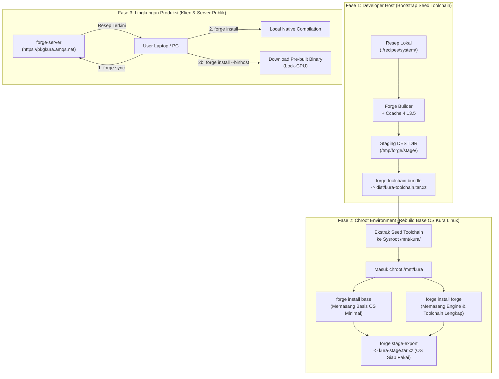
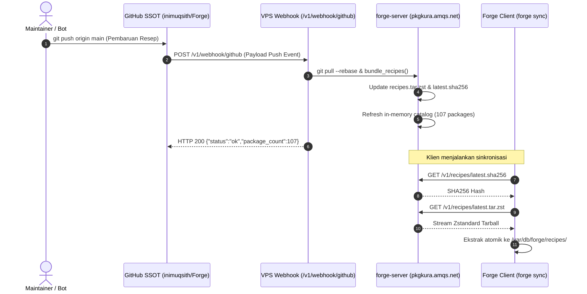
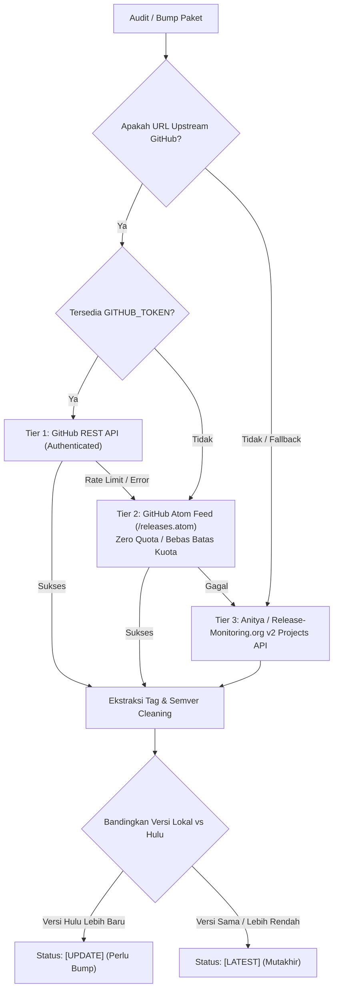
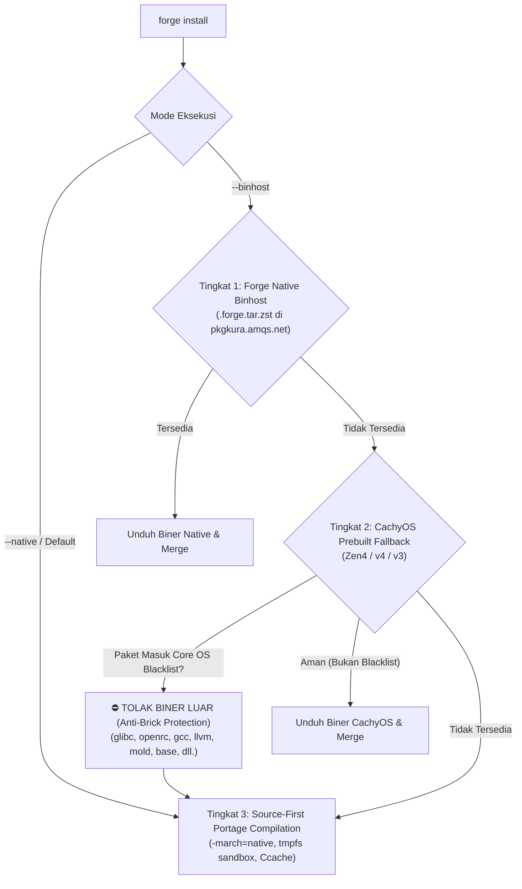
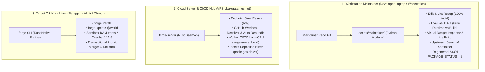

# ARCHITECTURE.md — Blueprint Arsitektur Package Manager `forge` & `forge-server`

> **`forge`** adalah *High-Performance Source-First Hybrid Package Manager* yang dibangun murni menggunakan bahasa **Rust** khusus untuk distribusi **Kura Linux**. Mengadopsi fondasi performa tinggi dari compiler **LLVM 22**, ultra-fast linker **`mold`**, Link-Time Optimization (**LTO Thin/Full**), dan dukungan **PGO (Profile-Guided Optimization)**, Forge menggabungkan filosofi kompilasi **Gentoo Portage** (*Source-First*, *USE Flags*, *Slots*), paradigma meta-paket modular modern (*`base`*, *`base-devel`*), akselerasi **Ccache (v4.13.5)**, DAG Dependency Resolver, Transactional Merger, Manifest Database, ekosistem **`forge-server` (Lock-CPU Build Farm & Upstream Bumper)**, konfigurasi terpusat (`/etc/forge/forge.conf`), repositori **GitOps SSOT**, serta akselerasi 3-Tier Package Cascade.

---

## 1. Topologi Cargo Workspace & Struktur Crate Rust (Clean 2-Crate Layout)

Forge dirancang menggunakan arsitektur modular yang terkonsolidasi secara rapi dalam 2 crate utama di dalam Cargo Workspace:

```
                                      [ PENGGUNA KURA LINUX ]
                                                 │
                                                 ▼
+=================================================================================================+
|                                  CRATE 1: `crates/forge`                                        |
|                          (Binary CLI Klien & Core Engine Library)                               |
+=================================================================================================+
|  1. CLI Dispatcher (`src/main.rs`)                                                              |
|     - `forge setup`, `forge build`, `forge install`, `forge remove`, `forge cpu-dump`           |
|     - `forge recipe-import`, `forge toolchain bundle`, `forge stage-export`, `forge list`       |
|                                                                                                 |
|  2. Core Engine Library (`src/lib.rs` & sub-modul internal):                                    |
|     ├── `src/builder.rs`   : Compilation Engine, tmpfs sandbox, Ccache 4.13.5, DESTDIR staging   |
|     ├── `src/resolver.rs`  : DAG Dependency Graph, Topological Sort, Circular Cycle Detector   |
|     ├── `src/merger.rs`    : Pre-flight Collision Check, Atomic Transactional Rootfs Merger    |
|     ├── `src/db.rs`        : Flat-File Manifest Database, Unmerge Cleaner, CONFIG_PROTECT       |
|     ├── `src/cpu.rs`       : Hardware Introspection (AVX-512/AVX2/Cache), `forge cpu-dump`      |
|     ├── `src/toolchain.rs` : Pure Source Seed Toolchain Bundler (ADR-019, Zero Host Harvesting) |
|     ├── `src/binhost.rs`   : Forge Binhost Client & Zstd/BLAKE3 streaming verification          |
|     ├── `src/cachyos.rs`   : CachyOS (Zen4/v4/v3) Adapter & Anti-Brick Core OS Blacklist Engine |
|     ├── `src/importer.rs`  : Upstream PKGBUILD/APKBUILD Recipe Transpiler                       |
|     ├── `src/cascade.rs`   : 3-Tier Package Cascade Resolver (--native & --binhost)             |
|     ├── `src/stage.rs`     : Distro Stage Exporter (kura-stage.tar.xz / .tar.zst)               |
|     └── `src/sync.rs`      : Client Sync Engine (/var/db/forge/recipes/)                        |
+=================================================================================================+
                                                 ▲
                                                 │ Sinkronisasi Resep & Unduhan Biner
                                                 ▼
+=================================================================================================+
|                                CRATE 2: `crates/forge-server`                                   |
|                            (Daemon Server & CI/CD Build Farm Suite)                             |
+=================================================================================================+
|  1. `forge-server serve`   : Recipe Registry REST API, Web Explorer & Webhook Receiver          |
|  2. `forge-server audit`   : Upstream Version Audit Engine (Pemindaian katalog paralel ~3 detik) |
|  3. `forge-server bump`    : Atomic Upstream Recipe Bumper + Auto-Push ke GitHub SSOT           |
|  4. `forge-server import`  : Profil Silikon Ingestion & Binary Catalog Ingester                 |
|  5. `forge-server build`   : CI/CD Worker Builder (Lock-CPU CFLAGS -> .forge.tar.zst)            |
|  6. `forge-server index`   : Generator database index repositori biner `packages.db.zst`        |
+=================================================================================================+
```

---

## 2. Paradigma Meta-Paket ("Everything is a Package")

Untuk menjaga agar engine Forge tetap ramping, bersih, dan universal (seperti Arch `pacman` atau Alpine `apk`), Forge mengadopsi filosofi **"Everything is a Package"**:

1. **Tidak Ada Target Magis yang Di-Hardcode:**
   - Tidak ada target `@system` khusus di dalam biner Rust.
   - Tidak ada wizard `system-setup` yang mencampuri urutan instalasi.
2. **Sistem Operasi Didefinisikan Sebagai Resep Meta-Paket Deklaratif & Paket Engine:**
   - **`base` (`recipes/system/base/recipe.toml`):** Mendefinisikan fondasi OS minimal (Glibc, Bash, Coreutils, Sed, Grep, OpenRC, Util-linux, Shadow, Eudev, Kmod, Acl, Attr).
   - **`forge` (`recipes/system/forge/recipe.toml`):** Engine package manager source-first yang mengintegrasikan seluruh toolchain kompilasi (LLVM, Mold, GCC, Binutils, Make, Ninja, Patch, Pkgconf, Linux-Headers, Git, Bubblewrap) sebagai dependensi runtime wajib (ADR-089).
3. **Konfigurasi Tunggal Terpusat (`/etc/forge/forge.conf`):**
   - Menjadi satu-satunya sumber kebenaran (*Single Source of Truth*) untuk variabel compiler (`cflags`, `makeflags`, `ldflags`), target microarchitecture silikon (`target_march`), dan `use_flags` global.

---

## 3. Siklus Hidup & Alur Kerja Ekosistem (The 3 Epochs)



---

## 4. Pipeline Bootstrap 2-Tahap: Menyelesaikan Paradoks Ayam dan Telur (*The Bootstrap Paradox*)

> **Pertanyaan Mendasar:** *"Bagaimana kita bisa menjalankan kompilasi paket di dalam chroot Kura Linux jika di dalam chroot belum ada toolchain compiler untuk mengompilasi?"*

Masalah ini diselesaikan melalui **Pipeline Bootstrap 2-Tahap**:

```
[ TAHAP 1: Di Luar Chroot / Mesin Host ]
1. Developer mengompilasi resep toolchain sistem (recipes/system/) di host.
2. Hasil kompilasi disimpan di staging terisolasi `/tmp/forge/stage/`.
3. Menjalankan `forge toolchain bundle`.
4. Engine memverifikasi UsrMerge, Glibc, Clang 22, Mold, Make, Ninja, dan menyertakan /var/db/forge/recipes/ serta default /etc/forge/forge.conf ke dalam `dist/kura-toolchain.tar.xz`.

[ TAHAP 2: Di Dalam Chroot Kura Linux ]
1. Administrator mengekstrak `dist/kura-toolchain.tar.xz` ke `/mnt/kura/`.
2. Masuk ke chroot: `chroot /mnt/kura /bin/bash`.
3. Menjalankan `forge install base` dan `forge install forge`.
4. Seluruh toolchain dan sistem inti Kura Linux terkompilasi ulang secara mandiri (self-hosted).
5. Menjalankan `forge stage-export` untuk menghasilkan tarball distribusi resmi `dist/kura-stage.tar.xz`.
```

---

## 5. Arsitektur GitOps Recipe Registry & GitHub Webhook Loop



---

## 6. Multi-Tier Zero-Quota Upstream Version Probing & Bumper Engine

Engine `RecipeAuditor` & `RecipeBumper` ([`scripts/maintainer/audit.py`](file:///home/admin/Development/Forge/scripts/maintainer/audit.py) & [`scripts/maintainer/bumper.py`](file:///home/admin/Development/Forge/scripts/maintainer/bumper.py)) menggunakan strategi 3-tier probing cerdas untuk mengaudit dan memperbarui resep hulu tanpa pernah terhambat *rate-limiting*:



---

## 7. 3-Tier Package Cascade Resolution & Anti-Brick Protection



---

## 8. Arsitektur 3-Peran Terisolasi (*Separation of Concerns: Maintainer vs Server vs Client*)

Untuk mencegah tumpang tindih tanggung jawab, ekosistem Forge membagi seluruh operasi ke dalam **3 domain terisolasi**:



---

## 9. Format Standar Resep All-in-One (`recipe.toml`)

```toml
[package]
name = "fastfetch"
version = "2.38.0"
release = 1
slot = "0"
description = "Like neofetch, but much faster because written in C"
license = "MIT"
upstream = "https://github.com/fastfetch-cli/fastfetch"

[dependencies]
runtime = ["glibc", "zlib"]
build = ["cmake", "ninja", "pkgconf", "gcc"]

[sources]
urls = ["https://github.com/fastfetch-cli/fastfetch/archive/refs/tags/2.38.0.tar.gz"]
sha256 = ["d99a9a5fbe7e9eb0eb66da9bc298ff2aa14594c9794cbdb702fa10e7b257da2e"]

[build]
type = "cmake"
script = """
cd "${srcdir}/fastfetch-${pkgver}"
cmake -B build -G Ninja \
    -DCMAKE_BUILD_TYPE=Release \
    -DCMAKE_INSTALL_PREFIX=/usr
ninja -C build ${MAKEFLAGS}
DESTDIR="${DESTDIR}" ninja -C build install
"""
```

---

## 10. Indeks Keputusan Arsitektur Resmi (ADR Index)

| ADR | Judul Keputusan | Status |
| :--- | :--- | :---: |
| **ADR-001** | Kompilasi 100% Native Silikon (`-march=native`, Thin LTO, Mold) | ✅ Diterapkan |
| **ADR-002** | Pengecualian Optimasi Custom pada Paket Glibc (Stabilitas Build System) | ✅ Diterapkan |
| **ADR-003** | Format Resep Hibrida: Deklaratif + POSIX Shell | ✅ Diterapkan |
| **ADR-004** | Database Flat-File `/var/db/forge/` Tanpa Ketergantungan Eksternal | ✅ Diterapkan |
| **ADR-005** | Isolasi Build RAM `tmpfs` & `DESTDIR` Staging | ✅ Diterapkan |
| **ADR-006** | Pemeriksaan Tabrakan Berkas & Manifest Deterministik | ✅ Diterapkan |
| **ADR-007** | Integrasi Layanan OpenRC Native (`/etc/init.d/`, `rc-update`) | ✅ Diterapkan |
| **ADR-008** | Meta-Target & `stage-export` Tarball Distribusi | ✅ Diterapkan |
| **ADR-009** | Protokol Mutlak HITL (Human-In-The-Loop) & Siklus Verifikasi | ✅ Diterapkan |
| **ADR-010** | Hierarki Resolusi Source-First Kompilasi Native | ✅ Diterapkan |
| **ADR-011** | Pohon Resep Terpusat di Server & Sinkronisasi Klien (`forge sync`) | ✅ Diterapkan |
| **ADR-012** | CI/CD Build Farm Locked to Target CPU Microarchitecture | ✅ Diterapkan |
| **ADR-013** | Introspeksi Hardware & Profil CPU (`forge cpu-dump`) | ✅ Diterapkan |
| **ADR-014** | Sistem USE Flags & Multi-Version Slotting ala Portage | ✅ Diterapkan |
| **ADR-015** | Pemisahan Binary Klien `forge` dan Server `forge-server` | ✅ Diterapkan |
| **ADR-016** | Konfigurasi Terpusat Single Source of Truth (`/etc/forge/forge.conf`) | ✅ Diterapkan |
| **ADR-017** | Implementasi Bahasa Rust & Pipeline Kompilasi Ultra-Cepat | ✅ Diterapkan |
| **ADR-018** | Isolated Seed Toolchain & Sysroot Packaging | ✅ Diterapkan |
| **ADR-019** | Penegakan Mutlak Pure Source-Built & Zero Host Harvesting | ✅ Diterapkan |
| **ADR-020** | Format Resep All-in-One `recipe.toml` & Hierarki Supremasi Compiler | ✅ Diterapkan |
| **ADR-021** | Suite Toolchain Hulu Terbaru 2026 (LLVM 22, Mold 2.42, Glibc 2.44, GCC 16) | ✅ Diterapkan |
| **ADR-022** | Topological DAG Dependency Resolution & Cycle Detection Engine | ✅ Diterapkan |
| **ADR-023** | Transactional Atomic Merger, Collision Detector & Manifest Database | ✅ Diterapkan |
| **ADR-024** | Config-Protected Unmerge Cleaner & Reverse Directory Pruning | ✅ Diterapkan |
| **ADR-025** | Integrated Compiler Acceleration with Ccache 4.13.5 & tmpfs Isolation | ✅ Diterapkan |
| **ADR-026** | Paradigma Meta-Paket Murni & Eliminasi Hardcoded @system / system-setup | ✅ Diterapkan |
| **ADR-027** | Pipeline Bootstrap 2-Tahap & Resolusi Paradoks Ayam-Telur | ✅ Diterapkan |
| **ADR-028** | Sistem Resep Terdedikasi `/var/db/forge/recipes/` & Kemandirian Chroot | ✅ Diterapkan |
| **ADR-029** | Disiplin Git Commit Berkala & Pembaruan Kontinu Dokumentasi Markdown | ✅ Diterapkan |
| **ADR-030** | Penyederhanaan CLI & 3-Tier Package Cascade Resolution | ✅ Diterapkan |
| **ADR-031** | Garansi Anti-Brick & Core OS Blacklist Protection | ✅ Diterapkan |
| **ADR-032** | Upstream Recipe Importer & Otomasi Katalog 100+ Resep Kura Linux | ✅ Diterapkan |
| **ADR-033** | Global Concurrency Lock RAII (`/var/lock/forge.lock`) | ✅ Diterapkan |
| **ADR-034** | Bubblewrap Sandbox Build Isolation (`--ro-bind / /`) | ✅ Diterapkan |
| **ADR-035** | ALPM DB Tarball Parser & Recursive Anti-Brick Resolver | ✅ Diterapkan |
| **ADR-036** | Pemisahan Tanggung Jawab Command Build & Import | ✅ Diterapkan |
| **ADR-037** | Ergonomis Penyimpanan Profil CPU & CI/CD Streamlined Build Server | ✅ Diterapkan |
| **ADR-038** | GitHub Webhook & Real-Time Auto-Rebundling GitOps | ✅ Diterapkan |
| **ADR-039** | Server-Side Multi-Tier Upstream Probing & GitHub SSOT Automated Bumping | ✅ Diterapkan |
| **ADR-040** | Penegakan Wajib Sandbox Bubblewrap & Pengecualian Self-Bootstrap `bubblewrap` | ✅ Diterapkan |
| **ADR-041** | Live Network Streaming Downloader & End-to-End Transactional Installation Pipeline | ✅ Diterapkan |
| **ADR-042** | Pure Rust Ed25519 Digital Package Signing & Supply-Chain Verification (`ed25519-dalek`) | ✅ Diterapkan |
| **ADR-043** | Dynamic Version Constraint Engine (`version-compare`) | ✅ Diterapkan |
| **ADR-044** | Multi-Core Data Parallelism on RAM tmpfs (`rayon`) | ✅ Diterapkan |
| **ADR-045** | Low-Level Linux Syscall Resource Governance & PID Liveness Detection (`nix`) | ✅ Diterapkan |
| **ADR-046** | Asynchronous Non-Blocking Streaming Decompression (`async-compression`) | ✅ Diterapkan |
| **ADR-047** | Pre-Flight Root Privilege Enforcement & Sudo/Doas Transparent Auto-Escalation | ✅ Diterapkan |
| **ADR-048** | Generic Post-Merge File Triggers & Hooks Engine (`HookEngine`) | ✅ Diterapkan |
| **ADR-049** | Wavefront Parallel DAG Scheduler & Multi-Worker Build Pool (`WavefrontScheduler`) | ✅ Diterapkan |
| **ADR-050** | Resumable HTTP Source Downloader with Multi-Mirror Fallback & Integrity Engine (`SourceDownloader`) | ✅ Diterapkan |
| **ADR-051** | TUI Menuconfig & Dynamic Recipe USE Flags Selector (`UseFlagsTui`) | ✅ Diterapkan |
| **ADR-052** | Seccomp BPF Syscall Filtering & Build Hardening Engine (`SeccompFilterBuilder`) | ✅ Diterapkan |
| **ADR-053** | Automated Server Source Code Rebuild & Seamless Self-Restart on Git Webhook | ✅ Diterapkan |
| **ADR-054** | Pure Self-Updating Package Philosophy & Live Git VCS Head Probe Update Engine | ✅ Diterapkan |
| **ADR-055** | Isolated 3-Tier Separation of Concerns & Modular Python Maintainer Suite Architecture (`scripts/maintainer/`) | ✅ Diterapkan |
| **ADR-056** | Implicit Ambient Build Tools Exemption & Foundation Toolchain Bootstrap Cycle Elimination | ✅ Diterapkan |
| **ADR-057** | Shared Aggregate Index Sanitization & Collision Exemption Engine (`/usr/share/info/dir`) | ✅ Diterapkan |
| **ADR-058** | CachyOS CDN77 Query Resolver & Isolated Prebuilt Installation | ✅ Diterapkan |
| **ADR-059** | Automated Recursive Binhost Dependency Resolution | ✅ Diterapkan |
| **ADR-060** | Canonical Distro Default Config & Serde Layered Overrides | ✅ Diterapkan |
| **ADR-061** | Disable Go Bindings in libcap C Toolchain Build | ✅ Diterapkan |
| **ADR-062** | Dependency Graph Pruning & Smart Skip for Installed Nodes | ✅ Diterapkan |
| **ADR-063** | Official Release Tarball for libxml2 | ✅ Diterapkan |
| **ADR-064** | Modern libacl Compatibility for GNU tar | ✅ Diterapkan |
| **ADR-065** | Upstream GNU GCC v16.2.0 SHA256 Checksum Alignment | ✅ Diterapkan |
| **ADR-066** | Per-Chunk Stream Idle Timeout vs Total Timeout in SourceDownloader | ✅ Diterapkan |
| **ADR-067** | Upstream URL & Checksum Realignment for gobject-introspection & libcap-ng | ✅ Diterapkan |
| **ADR-068** | Smart Multi-Ecosystem Auditor Engine & GNU MPC v1.4.1 Bump | ✅ Diterapkan |
| **ADR-069** | Bubblewrap Sandbox Writable Bind Mount for Ccache Acceleration | ✅ Diterapkan |
| **ADR-070** | Fast Clean Python Bootstrap Build without PGO Overhead | ✅ Diterapkan |
| **ADR-071** | Non-Archive Raw Source File Handling, Dynamic USE Env Injection, & SSOT Matrix Accuracy | ✅ Diterapkan |
| **ADR-072** | Pip-less Standard `setup.py` Bootstrapping for Meson Build Engine | ✅ Diterapkan |
| **ADR-073** | Target CFLAGS Sanitization for GCC Runtime Libraries (`-flto=auto`) | ✅ Diterapkan |
| **ADR-074** | Automated Pre-Build Workspace Sanitization (`/tmp/forge/build/`) | ✅ Diterapkan |
| **ADR-075** | Exclusion of LTO in GCC Target Runtime Libraries (`-fno-lto` for `libgcc`) | ✅ Diterapkan |
| **ADR-076** | Obsolete Meson Option Removal for Bubblewrap v0.12.0 (`require_userns`) | ✅ Diterapkan |
| **ADR-077** | Explicit CMake/Build ASM Compiler Declaration & Global Environment Export (`ASM`) | ✅ Diterapkan |
| **ADR-078** | Elimination of Redundant LLVM `libunwind` Runtime in GNU Toolchain | ✅ Diterapkan |
| **ADR-079** | C-Dependency Crate LTO Sanitization for In-Tree Cargo Package Builds | ✅ Diterapkan |
| **ADR-080** | Smart Staging Cache Reuse & Idempotent Resumption in Wavefront Scheduler | ✅ Diterapkan |
| **ADR-081** | Deterministic Staging Completion Markers, Partial Cleanup on Build Error & Atomic Merger Hardening | ✅ Diterapkan |
| **ADR-082** | Hermetic Offline Stage0 Bootstrapping for Rust Toolchain | ✅ Diterapkan |
| **ADR-083** | Unified Monolithic LLVM Toolchain Consolidation & Clang Meta-Package Alias | ✅ Diterapkan |
| **ADR-084** | O(1) In-Memory Pre-Flight Collision Indexing & Shared System Cargo Cache | ✅ Diterapkan |
| **ADR-085** | Spaced Path Manifest Parsing & Bubblewrap Network Sharing for Cargo | ✅ Diterapkan |
| **ADR-086** | Explicit Readline Shared Library Linking with `--no-as-needed` for Ncurses DT_NEEDED Entry | ✅ Diterapkan |
| **ADR-087** | Topological Priority Queue & Real-Time Pipelined Transactional Merge in Wavefront Scheduler | ✅ Diterapkan |
| **ADR-088** | HTTP/2 Library Integration via `nghttp2` for Git HTTPS & Curl Remote Operations | ✅ Diterapkan |
| **ADR-089** | Integration of Compilation Toolchain into `forge` Runtime Dependencies & Elimination of `base-devel` Meta-Package | ✅ Diterapkan |
| **ADR-090** | Complete Decompression Suite (`gzip`, `bzip2`, `xz`, `zstd`, `tar`) Integration into `forge` Runtime Dependencies | ✅ Diterapkan |


