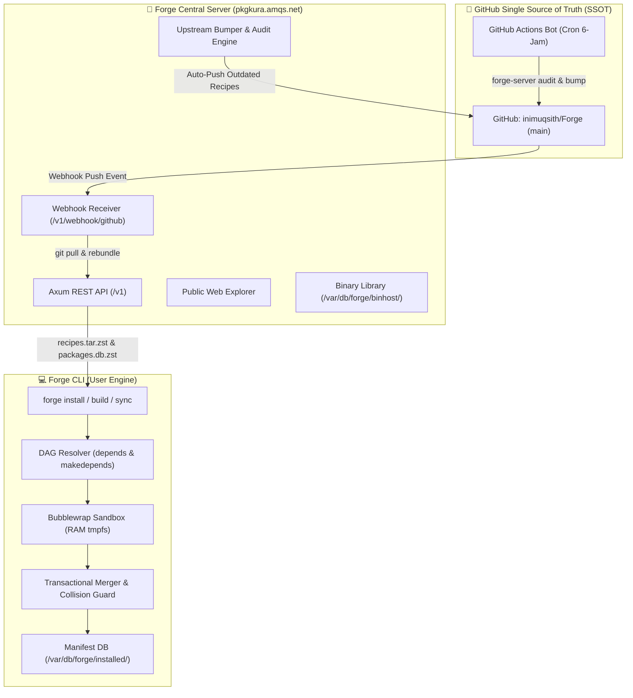

# Forge — The High-Performance Source-First Package Manager

> **Forge**: *High-Performance Source-First & Hybrid Package Manager* yang ditulis murni menggunakan bahasa **Rust** khusus untuk distribusi **Kura Linux**. Ditenagai compiler **LLVM 22**, ultra-fast linker **`mold`**, Link-Time Optimization (**Thin/Full LTO**), dan dukungan **PGO**, Forge mengusung filosofi kompilasi **Gentoo Portage** (*Source-First Native Compilation*, *USE Flags*, *Slots*), arsitektur modular modern (*`base`*, *`base-devel`*), akselerasi **Ccache (v4.13.5)**, DAG Dependency Resolver, Transactional Merger, isolasi sandbox **Bubblewrap**, repositori terpusat **GitOps SSOT**, serta ekosistem terpisah **`forge-server` (Lock-CPU CI/CD Build Farm & Upstream Bumper)**.

---

## ⚡ Fitur Utama & Filosofi Desain



- **🦀 Pure Rust & Extreme Optimization:** Ditulis murni dalam Rust, dikompilasi dengan backend LLVM 22, ultra-fast linker `mold`, optimasi Thin LTO, dan flag native silicon `-C target-cpu=native`.
- **🚀 Source-First Native Compilation (Gentoo Mode):** Secara default mengompilasi paket langsung dari kode sumber upstream dengan flag native target mentok ekstrem (`-O3 -march=native -pipe -flto=thin -fno-math-errno -falign-functions=32`) di RAM `tmpfs`.
- **⚡ Ccache 4.13.5 Acceleration:** Integrasi otomatis compiler cache untuk memangkas waktu kompilasi ulang hingga 80-90%.
- **🐙 GitHub Single Source of Truth (SSOT) & GitOps Automation:** Seluruh resep dikelola di repository GitHub `inimuqsith/Forge`. Webhook real-time secara instan memicu pembaruan dan rebundling tarball di server VPS `https://pkgkura.amqs.net`.
- **🤖 Zero-Quota Upstream Recipe Bumper & Audit Engine:** Memindai seluruh katalog paket dalam ~3 detik melalui Multi-Tier Probing (GitHub REST API dengan Token, GitHub Atom Feed `/releases.atom` bebas kuota, dan Anitya v2 Projects API) serta memperbarui versi & SHA256 secara atomik (`forge-server bump`). Matriks lengkap dapat dilihat di [`recipes/PACKAGE_STATUS.md`](file:///home/admin/Development/Forge/recipes/PACKAGE_STATUS.md).
- **🌾 Pure Source-Built Seed Toolchain (ADR-019, ADR-028):** Pengemasan `forge toolchain bundle` (`dist/kura-toolchain.tar.xz`) murni 100% dari hasil kompilasi source code di staging tanpa menyalin biner host, menyertakan seluruh `/var/db/forge/recipes/` sehingga lingkungan chroot mandiri seketika.
- **📦 Meta-Paket Murni ("Everything is a Package", ADR-026):** Basis OS dikelola murni melalui resep meta-paket deklaratif (`forge install base` dan `forge install base-devel`) tanpa hardcode logika OS di dalam biner package manager.
- **🗃️ Sistem Resep Terdedikasi & `forge sync` (ADR-028):** Repositori resep resmi berlokasi di `/var/db/forge/recipes/`, disinkronkan secara atomik dari `forge-server` melalui perintah `forge sync`.
- **🌳 DAG Dependency Graph & Cycle Detection:** Resolver dependensi asiklis terarah dengan pemisahan dependensi runtime (`depends`) dan build-time (`makedepends`), evaluasi USE flags, dan pengurutan topologis.
- **🔒 Transactional Merger & Collision Detector:** Pre-flight scanning untuk mencegah tabrakan berkas dan penggabungan atomik dari staging `$DESTDIR` ke target `$FORGE_ROOT` dengan auto-rollback jurnal LIFO.
- **📁 Flat-File Manifest Database:** Pencatatan deterministik berkas, checksum SHA256, dan metadata build di `/var/db/forge/installed/` tanpa ketergantungan DB eksternal yang rapuh.
- **🎛️ Granular USE Flags & Slots:** Mengaktifkan/menonaktifkan fitur perangkat lunak secara presisi di level global (`forge.conf`) atau per-paket (`package.use`) dan multi-version slots (`pkg:slot`).
- **⚡ Opsi Akselerasi 3-Tier Package Cascade Resolution (Opt-In):**
  - **3-Tier Cascade (`--binhost`):** Resolusi 3 tingkat: (1) Forge Native Binhost (`.forge.tar.zst`), (2) CachyOS Prebuilt (Zen4/v4/v3) dengan Anti-Brick Core OS protection, (3) Source Code fallback.
  - **Native Compilation (`--native` / Default):** Kompilasi 100% dari kode sumber secara native (Portage mode).
- **🔬 Introspeksi Hardware (`forge cpu-dump`):** Menganalisis CPU host, ekstensi ISA (AVX-512, AVX2, SSE4, dll.), cache, dan mengekspor profil hardware `cpu-profile.json`.
- **🏭 Suite Terpisah `forge-server`:** Daemon server resep terpusat (`serve`), Public Web Explorer, worker CI/CD builder lock-CPU (`forge-server build`), dan binary indexer (`forge-server index`).
- **⚙️ Integrasi OpenRC Native:** Otomatis mendeteksi skrip di `/etc/init.d/` dan terintegrasi dengan `rc-update`.
- **📦 Distro Stage Exporter (`forge stage-export`):** Utilitas pengemas rootfs menjadi tarball distribusi Kura Linux (`dist/kura-stage.tar.xz`).

---

## 🛠️ Panduan Perintah CLI

### A. Klien Pengguna (`forge`)

```bash
# --- 1. Inisialisasi Konfigurasi & USE Flags ---
forge setup                     # Inisialisasi konfigurasi package manager (/etc/forge/forge.conf)
forge menuconfig                # TUI interaktif untuk konfigurasi USE flags global / per-paket

# --- 2. Manajemen Paket (Default: Source Compilation First) ---
forge install base              # Pasang sistem dasar Kura Linux (Meta-Paket)
forge install base-devel        # Pasang toolchain kompilasi Kura Linux (Meta-Paket)
forge install <pkg>             # Kompilasi dari source code secara native (Default Gentoo-style)
forge install --native <pkg>    # Paksa kompilasi 100% dari kode sumber (Portage mode)
forge install --strip <pkg>     # Kompilasi dengan pembersihan simbol debug (modul & biner ramping)
forge install --binhost <pkg>   # 3-Tier Cascade: Forge Binhost -> Fallback CachyOS Zen4/v4/v3 -> Source
forge build <pkg>               # Kompilasi dari source & kemas ke .forge.tar.zst tanpa pasang ke host
forge recipe-import <url|file>  # Transpilasi PKGBUILD Arch / APKBUILD Alpine ke recipe.toml
forge remove <pkg>              # Hapus paket secara bersih berdasarkan manifest
forge sync                      # Sinkronisasi pohon resep dari Forge Server (https://pkgkura.amqs.net)
forge update @world             # Re-kompilasi / perbarui seluruh paket terpasang

# --- 3. Introspeksi Hardware ---
forge cpu-dump                  # Dump mikroarsitektur CPU & simpan cpu-profile.json
forge cpu-dump --export-cflags  # Tampilkan rekomendasi CFLAGS untuk CPU saat ini

# --- 4. Manajemen & Bundler Seed Toolchain ---
forge toolchain status          # Cek status Clang/LLVM 22, mold, GCC, Make, Ninja, Glibc
forge toolchain bundle          # Kemas seed toolchain murni ke dist/kura-toolchain.tar.xz (ADR-019)

# --- 5. Informasi & Query ---
forge list                      # Tampilkan daftar seluruh paket terpasang & versinya
forge query <pkg>               # Tampilkan metadata, USE flags aktif, dependensi, & manifest
forge search <query>            # Cari resep paket berdasarkan nama/deskripsi

# --- 6. Fitur Distro Khusus ---
forge stage-export --output kura-stage.tar.xz  # Kemas rootfs menjadi stage tarball distribusi
```

### B. Infrastruktur Server & CI/CD (`forge-server`)

```bash
# --- 1. Layanan API & Web Explorer ---
forge-server serve              # Jalankan service HTTP API resep, Web Explorer & Webhook receiver

# --- 2. Upstream Recipe Bumper & Audit Engine ---
forge-server audit              # Memindai seluruh resep terhadap rilis upstream terbaru
forge-server bump <pkg>         # Perbarui resep spesifik ke versi hulu terbaru & auto-push ke GitHub
forge-server bump --all         # Perbarui SELURUH resep yang memiliki update & auto-push ke GitHub

# --- 3. Manajemen Profil CPU & CI/CD Builder ---
forge-server import <cpu-profile.json> [--as <name>] # Impor profil CPU target & set sebagai aktif
forge-server list-profiles      # Tampilkan seluruh profil CPU yang tersimpan di server
forge-server build <package>    # CI/CD Worker: Kompilasi paket dengan profil CPU aktif & publikasi binhost
forge-server index              # Regenerasi database index repositori biner packages.db.zst
```

---

## 🌐 Layanan Publik & Endpoints Server

Server resmi Kura Linux beroperasi di domain **`https://pkgkura.amqs.net`**:

| Endpoint | Metode | Deskripsi |
| :--- | :---: | :--- |
| `/` | `GET` | **Public Web Repository Explorer** (Tampilan visual interaktif katalog resep paket) |
| `/v1/health` | `GET` | Health check endpoint server status |
| `/v1/recipes/latest.sha256` | `GET` | Hash SHA256 tarball resep terbaru |
| `/v1/recipes/latest.tar.zst` | `GET` | Streaming arsip tarball resep terkompresi Zstandard |
| `/v1/webhook/github` | `GET/POST` | **GitHub Webhook Receiver** (Memicu auto `git pull` & rebundle real-time) |
| `/v1/recipes/refresh` | `POST` | Pemicu manual sinkronisasi & bundling ulang resep |
| `/v1/packages.json` | `GET` | Katalog JSON seluruh paket resep yang tersedia |
| `/v1/binhost/<march>/catalog.json` | `GET` | Katalog biner resmi per-arsitektur CPU (znver4, x86-64-v3, dll.) |
| `/v1/binhost/<march>/<pkg>.forge.tar.zst` | `GET` | Unduhan paket biner native pre-compiled |

---

## 🔨 Membangun Forge dari Kode Sumber (Rust)

```bash
# Kompilasi rilis dengan optimasi native silikon & linker mold
cargo build --release

# Menjalankan test suite komprehensif (95 unit & integration tests)
cargo test --workspace
```

Biner hasil kompilasi:
- `target/release/forge` (CLI Klien Pengguna)
- `target/release/forge-server` (Server, CI/CD Suite & Bumper Engine)

---

## 📜 Standar Format Resep All-in-One (`recipe.toml`)

```toml
[package]
name = "fastfetch"
version = "2.38.0"
release = 1
slot = "0"
description = "Like neofetch, but much faster because written in C"
license = "MIT"
upstream = "https://github.com/fastfetch-cli/fastfetch"

[dependencies]
runtime = ["glibc", "zlib"]
build = ["cmake", "ninja", "pkgconf", "gcc"]

[sources]
urls = ["https://github.com/fastfetch-cli/fastfetch/archive/refs/tags/2.38.0.tar.gz"]
sha256 = ["d99a9a5fbe7e9eb0eb66da9bc298ff2aa14594c9794cbdb702fa10e7b257da2e"]

[build]
type = "cmake"
script = """
cd "${srcdir}/fastfetch-${pkgver}"
cmake -B build -G Ninja \
    -DCMAKE_BUILD_TYPE=Release \
    -DCMAKE_INSTALL_PREFIX=/usr
ninja -C build ${MAKEFLAGS}
DESTDIR="${DESTDIR}" ninja -C build install
"""
```

---

## 🧭 Dokumentasi Pengembangan & Panduan Teknis

- **Pedoman AI & Protokol Mutlak HITL:** Lihat [`AGENTS.md`](file:///home/admin/Development/Forge/AGENTS.md).
- **Blueprint Arsitektur & Desain Sistem:** Lihat [`ARCHITECTURE.md`](file:///home/admin/Development/Forge/ARCHITECTURE.md).
- **Memori Persisten, Roadmap 14 Fase & 52 ADR:** Lihat [`MEMORY.md`](file:///home/admin/Development/Forge/MEMORY.md).
- **Manual GitOps, Webhook & Upstream Bumper:** Lihat [`docs/GITOPS_AND_BUMPER_MANUAL.md`](file:///home/admin/Development/Forge/docs/GITOPS_AND_BUMPER_MANUAL.md).
- **Spesifikasi Resep Paket & USE Flags:** Lihat [`docs/RECIPE_SPECIFICATION.md`](file:///home/admin/Development/Forge/docs/RECIPE_SPECIFICATION.md).
